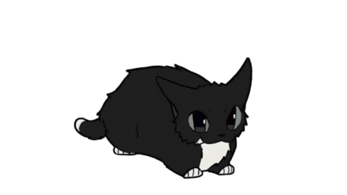

BorealOS is a Debian based (debian 13, trixie) linux distro for desktops. It gives an optimized debian experience without SystemD (using OpenRC instead).

 

## Concept

| Area | Plans |
|---|---|
| Base | Debian based |
| Architecture | x86_64 (for now) |
| Target Users | Intermediate users |
| Init System | OpenRC |
| Shells | `sh` & `fish` |
| Kernel Versions | 7.0 Current, 6.18 LTS |

 

## Key Features

- Debian based desktop operating system
- Community driven development
- Pre-customized desktop environments and window managers
- Safety warnings before running risky commands

 

## Supported Desktops

BorealOS plans to offer a choice of four graphical interfaces during setup:

- KDE Plasma
- XFCE
- Niri
- <a href="https://github.com/m4rn-progs/TaigaWM">TaigaWM</a>

 

## Shells

- The `sh` shell is set as the default shell
- The `fish` shell is available as an option during setup

 

## Kernels

BorealOS comes with 2 linux kernels, which are:
 - 7.0 Current. (Modern, new)
 - 6.18 LTS. (Long-lasting, stable)

 

## Planned documentation

- Installation guide
- Man pages
- Init system usage
- Desktop environment / Window manager customization
- Troubleshooting

 

## Development Status & Milestones

- BorealOS is currently in the early repository structuring and planning phase
- The first technical milestone is a minimal debian based ISO that successfully boots in a virtual machine using `OpenRC` as PID 1

 

## Licence

- BorealOS is a free and open source licensed under GNU General Public License v3 [GPL-3.0]
- This software is free to use, to modify, and to redistribute provided that all of the derived works must be entirely open source under this licence

 

## Cat

